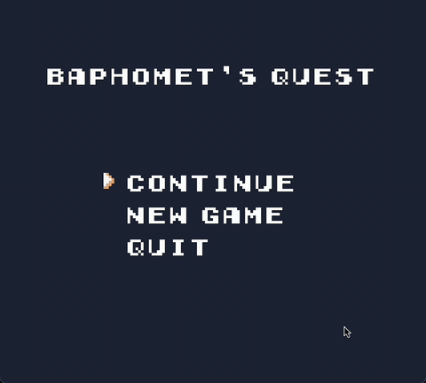

# Baphomet's Quest

[](https://github.com/inigo-selwood/Baphomet-s-Quest/actions/workflows/build.yaml)
[](https://github.com/inigo-selwood/Baphomet-s-Quest/actions/workflows/build.yaml)



Small SDL game!

Install build tools and native libraries using the
[installation guide](wiki/installation.md)

## Usage

| Command | Description |
| --- | --- |
| `task` | List available tasks |
| `task run` | Build and run the debug game |
| `task build` | Build an optimised release and bundle resources |
| `task test` | Build and run unit tests |
| `task coverage` | Build tests and generate a coverage report |
| `task format` | Format source and resource files |
| `task docs` | Build and open Doxygen documentation |
| `task clean` | Remove generated build and tooling output |

## Layout

| Path | Purpose |
| --- | --- |
| `source/core` | CLI arguments and logging |
| `source/engine` | Runtime, nodes, resources, rendering, utilities |
| `source/scenes` | Game scenes, scene XML, scene-specific components |
| `test/unit` | Fast unit and integration-style engine checks |
| `resources` | Fonts, textures, music, maps, configuration |
| `documentation` | Doxygen config and guide source |
| `configuration` | CMake, Task, and formatter configuration |
| `wiki` | Human setup notes |

## Documentation

Run:

```bash
task docs
```

Generated docs are written under `build/docs`. Guide source lives under
`documentation/guides`
